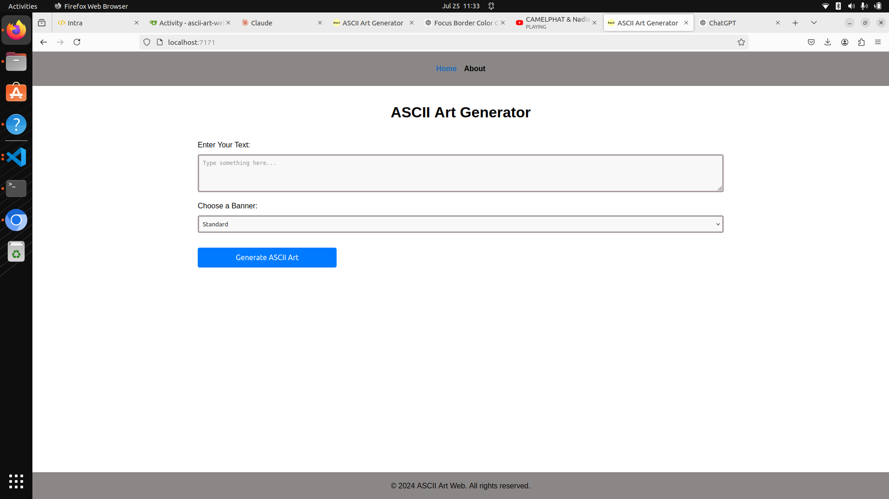
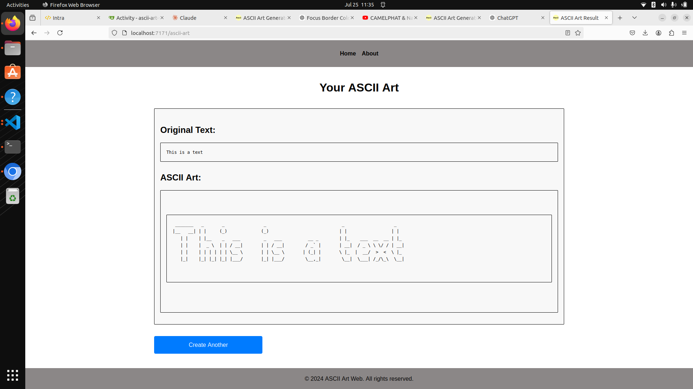

# ASCII Art Web Stylize

ASCII Art Web Stylize is a Go project that allows users to generate ASCII art from input text using various predefined banners through a stylized web interface.

## Table of Contents
- `Introduction`
- `Features`
- `Project Structure`
- `Installation`
- `Usage`
- `Algorithm`
- `Contributing`

## Introduction

ASCII Art Web Stylize provides a simple web interface to convert input text into ASCII art using different banner styles such as 'standard', 'shadow', and 'thinkertoy'. The project utilizes Go's HTTP package to handle requests and templates for rendering HTML responses. The web page is maintained and styled using css.

## Features

- **Generate ASCII Art**: Converts input text into ASCII art using selected banner styles.
- **Web Interface**: Accessible through a web browser, with forms for input and banner selection.
- **Error Handling**: Provides meaningful error messages for invalid input or file reading failures.


## Project Structure
**The project structure is organized as follows:**

* `main.go`: Entry point of the application, sets up HTTP server and handles routing.
* `utils/`: Contains utility functions for file reading, ASCII art generation, and banner selection.
* `templates/`: HTML templates for rendering the web interface and displaying results.
* `banners/`: ASCII art files for different banner styles ('standard.txt', 'shadow.txt', 'thinkertoy.txt').

## Installation
1. **Install dependencies:**

    Ensure you have [Go](https://go.dev/doc/install) installed.

2. **Clone the repository:**

   ```bash
   git clone https://learn.zone01kisumu.ke/git/bernaotieno/ascii-art-web-stylize
   cd ascii-art-web-stylize
   ```

 ## Usage

1. **Start the server:**
    ```go
    go run .
    ```

2. **Access the web interface:**

Open a web browser and go to http://localhost:9090.

3. **Generate ASCII Art:**

    * Enter your text in the input box.
    * Select a banner style ('standard', 'shadow', 'thinkertoy').
    * Click on the 'Generate' button to see the ASCII art based on your input.

### Example


*Input your text and select a banner style.*



*View the generated ASCII art.*

## ALGORITHM ASCII Art Web Generator

### FUNCTION ServeIndex(request, response):
    IF request method is not GET:
        Return 400 Bad Request
    IF request path is "/":
        Serve "templates/index.html"
    ELSE:
        Return 404 Not Found

### FUNCTION GenerateASCIIArt(request, response):
    IF request method is not POST:
        Return 405 Method Not Allowed
    
    input = Get "input" from form data
    banner = Get "banner" from form data
    
    IF input is empty:
        Return 400 Bad Request "Input is required"
    
    content = Read ASCII map file based on banner
    IF error reading file:
        Log error
        Return 500 Internal Server Error
    
    contentLines = Split content into lines
    
    art = Generate ASCII art from input and contentLines
    IF error generating art:
        Return 400 Bad Request
    
    Render "templates/result.html" with generated art
    IF error rendering template:
        Log error
        Return 500 Internal Server Error

### HELPER FUNCTIONS:
    ReadsFile(filename): Read and return file contents
    GetFile(banner): Return filename based on banner type
    SplitFile(content): Split content into lines
    DisplayText(input, contentLines): Generate ASCII art

### ERROR HANDLING:
    - Check for valid HTTP methods
    - Validate input presence
    - Handle file reading errors
    - Handle ASCII art generation errors
    - Handle template rendering errors

END ALGORITHM


## Contributing
**Contributions are welcome! If you'd like to contribute to this project, please follow these steps:**

1. Fork the repository and clone it locally.
2. Create a new branch for your feature or bug fix.
3. Make your changes and test them thoroughly.
4. Submit a pull request detailing your changes and improvements.

## Author
**This Project was Authored and maintaned by:**

 

 [Moses Onyango](https://learn.zone01kisumu.ke/git/moonyango) 


 

 [Bernad Okumu](https://learn.zone01kisumu.ke/git/bernaotieno)

